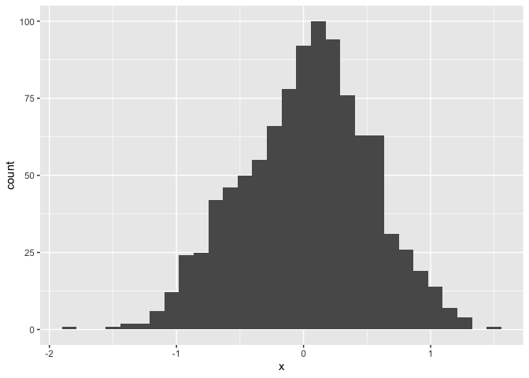
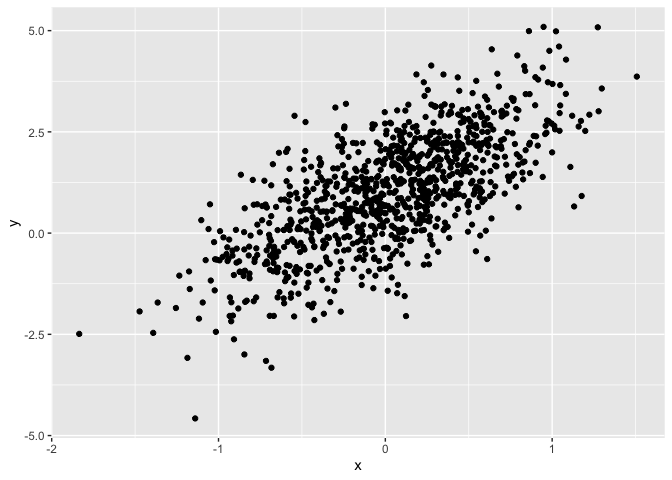
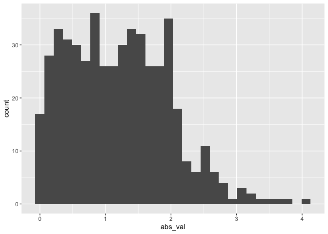

Simple
================
Mia Yu
2023-09-12

``` r
library(tidyverse)
```

    ## ── Attaching core tidyverse packages ──────────────────────── tidyverse 2.0.0 ──
    ## ✔ dplyr     1.1.3     ✔ readr     2.1.4
    ## ✔ forcats   1.0.0     ✔ stringr   1.5.0
    ## ✔ ggplot2   3.4.3     ✔ tibble    3.2.1
    ## ✔ lubridate 1.9.2     ✔ tidyr     1.3.0
    ## ✔ purrr     1.0.2     
    ## ── Conflicts ────────────────────────────────────────── tidyverse_conflicts() ──
    ## ✖ dplyr::filter() masks stats::filter()
    ## ✖ dplyr::lag()    masks stats::lag()
    ## ℹ Use the conflicted package (<http://conflicted.r-lib.org/>) to force all conflicts to become errors

# Section 1: First Chunk

Here’s a **code chunk** that samples from a_normal distribution\_:

``` r
samp = rnorm(100)
length(samp)
```

    ## [1] 100

# Section 2: Make a plot

This code is borrowed from last lecture;

``` r
plot_df = 
  tibble(
    x=rnorm(1000, sd = 0.5),
    y = 1 + 2 * x + rnorm(1000)
  )
```

Next up is a histogram of `x` variable in `plot_df`.

``` r
ggplot(plot_df, aes(x = x)) + geom_histogram()
```

    ## `stat_bin()` using `bins = 30`. Pick better value with `binwidth`.

<!-- -->

Lastly, I will do a scatterplot.

``` r
ggplot(plot_df, aes(x = x, y = y)) + geom_point()
```

<!-- -->

here’s a list:

- this is the first list thing
- here’s another list item

# Section 3: Learning assessment!

``` r
la_df= 
  tibble(
    num_samp = rnorm(500, mean = 1),
    log_vec = num_samp > 0,
    abs_val = abs(num_samp)
  )

ggplot(la_df, aes(x = abs_val)) + geom_histogram()
```

    ## `stat_bin()` using `bins = 30`. Pick better value with `binwidth`.

<!-- -->

# Section 4: Text formatting examples

## Text formatting

*italic* or *italic* **bold** or **bold** `code` superscript<sup>2</sup>
and subscript<sub>2</sub>

## Headings

# 1st Level Header

## 2nd Level Header

### 3rd Level Header

## Lists

- Bulleted list item 1

- Item 2

  - Item 2a

  - Item 2b

1.  Numbered list item 1

2.  Item 2. The numbers are incremented automatically in the output.

## Tables

| First Header | Second Header |
|--------------|---------------|
| Content Cell | Content Cell  |
| Content Cell | Content Cell  |
